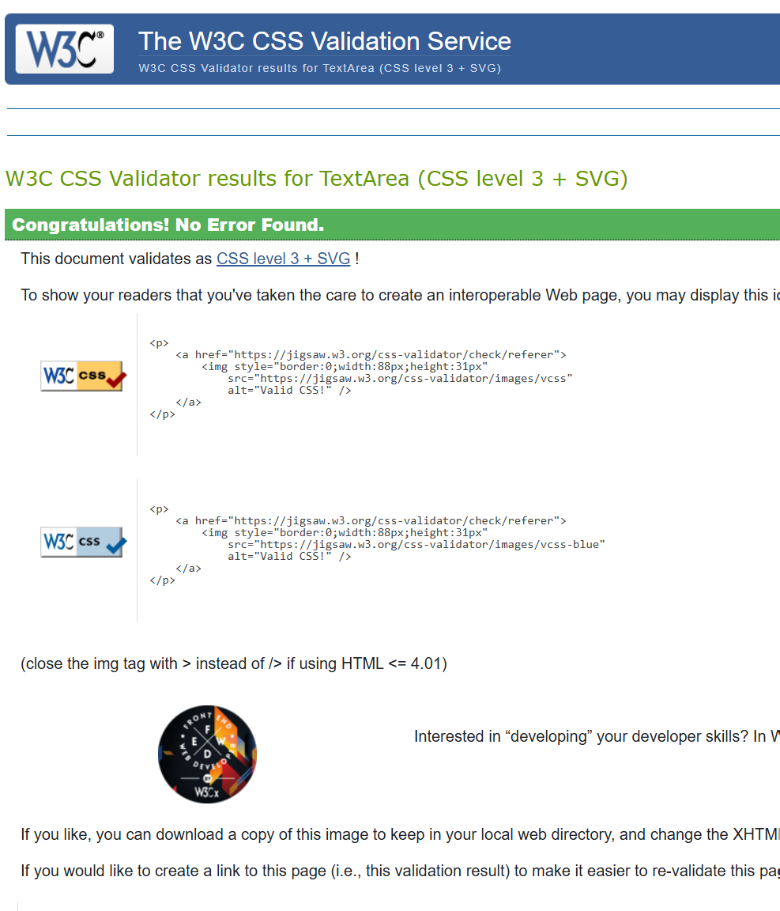
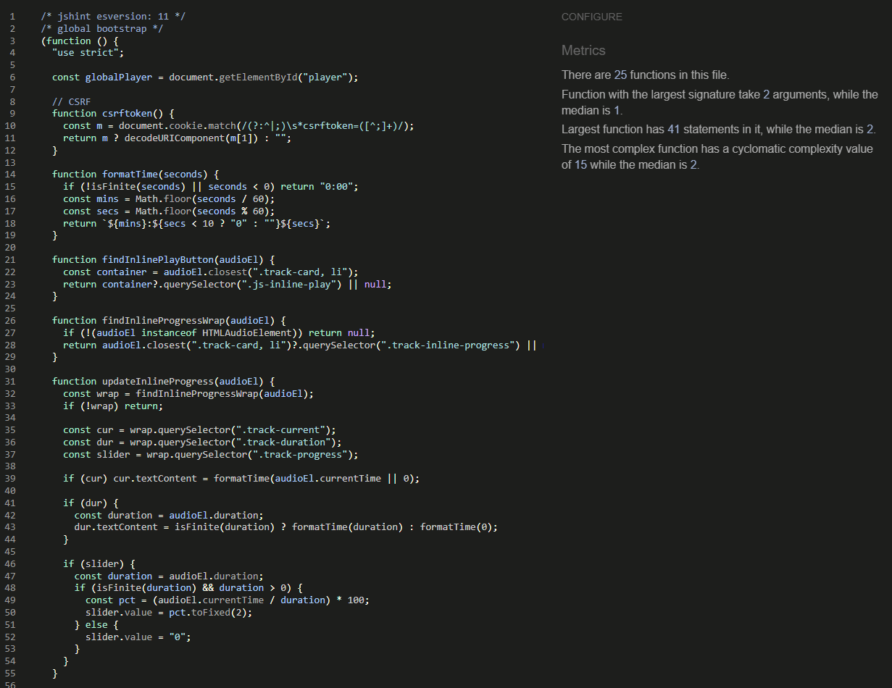

# Music-Archiver

[](#)
[](#)
[](LICENSE)

> Save, organise, and play web music links with albums, playlists, ratings, favourites, and social sharing.

- 🎵 **Live Demo**: [music-archiver-498e27441f42.herokuapp.com](https://music-archiver-498e27441f42.herokuapp.com/)
- 💻 **Repository**: [github.com/ie3ul2df/Music-Archiver](https://github.com/ie3ul2df/Music-Archiver)

---

## Table of Contents

- [Project Overview](#project-overview)
  - [UX](#ux)
- [Wireframes](#low-and-high-fidelity-wireframes)
- [Architecture & Data Model](#architecture--data-model)
- [Tech Stack](#tech-stack)
- [Getting Started](#getting-started)
  - [Quickstart](#quickstart)
  - [Configuration](#configuration)
- [Deployment on Heroku](#deployment-on-heroku)
- [Testing](#testing)
- [Accessibility & Security](#accessibility--security)
- [Roadmap & Known Issues](#roadmap--known-issues)
- [Challenges](#challenges)
- [Future Work](#future-work)
- [Troubleshooting / FAQ](#troubleshooting--faq)
- [Contributing](#contributing)
- [License](#license)
- [Contact](#contact)

---

## Project Overview

**Music-Archiver** is a full-stack Django web application that allows users to save, organise, and stream music links from across the web.  
It provides a lightweight alternative to traditional streaming platforms, giving users control over how they curate, play, and share their collections.

The platform balances **personal music libraries** with **social discovery features**. Users can create albums and playlists, upload their own tracks or link to streaming URLs, and enhance engagement with favourites, ratings, and snapshots of other users’ collections.

Key highlights include:

- 🎵 **Albums & Playlists** — Create and manage personal music collections with drag-and-drop track ordering.
- ⭐ **Engagement Features** — Rate, favourite, and review recent play history to rediscover tracks.
- 👥 **Social Saving** — Save or snapshot albums and tracks from other users, with update notifications.
- 💾 **Flexible Storage** — Upload audio files to Cloudinary or add direct streaming URLs.
- 💳 **Plans & Subscriptions** — Start free with limited albums, then upgrade to Premium via Stripe checkout for higher storage and feature limits.
- 🎚️ **Responsive Media Player** — Play, pause, shuffle, skip, and adjust volume with a clean UI optimised for mobile and desktop.
- 🔍 **Search & Filter** — Quickly locate albums or tracks in large collections.

Whether for **music collectors** who want to centralise links, or **creators** who share curated playlists, Music-Archiver delivers a streamlined listening experience with just the features users need—no bloat, no lock-in.

---

## UX

### Project Goals

- Allow users to save, organise, and play web-hosted music links.
- Provide enhanced functionality and higher storage limits through Premium plans (via Stripe subscriptions).

### Target Audience

- **Music collectors** who want lightweight playlists and albums built from web sources.
- **Creators and curators** who share their collections with followers.

### User Stories (MoSCoW)

- **Must**

  - As a user, I can register or log in so that my albums and playlists persist across sessions.
  - As a user, I can create albums and add tracks to organise my collection.
  - As a user, I can upgrade to a Premium plan to unlock higher limits on albums, playlists, and storage.
  - As a user, I can upload audio files or link streaming URLs so my library supports all my sources.
  - As a user, I can build playlists and control track order so playback flows as expected.
  - As a user, I can play music with controls (play, pause, next, shuffle, volume) for a seamless experience.
  - As a user, I can manage my profile details and contact information to personalise my account and speed up checkout.
  - As a user, I can search and filter my library to quickly find albums or tracks.

- **Should**

  - As a user, I can rate and favourite tracks or albums so my preferences influence my listening.
  - As a user, I can reorder tracks inside albums and playlists via drag-and-drop.
  - As a user, I can review my recent play history to rediscover songs.
  - As a user, I can choose whether an album is public or private for better control over visibility.
  - As a user, I can track my storage usage to know when I am approaching plan limits.

- **Could**
  - As a user, I can save snapshots of other users’ albums to revisit later.
  - As a user, I can copy individual tracks from other collections into my own albums.
  - As a user, I can see when a saved album or track has been updated so I know when to refresh my snapshot.

### Acceptance Criteria (Examples)

- **Given** I am logged in, **when** I add a track URL, **then** it appears in my album and is playable.
- **Given** my payment succeeds, **when** I return to my profile, **then** my plan shows as Premium and my limits are updated.

### Sitemap

- Home → Albums → Album Detail → Player
- Profile → My Albums / Playlists / Favourites
- Plans → Basket → Checkout (Stripe) → Success / Cancel
- Login / Register / Logout

### Core Features

- User accounts with registration, login, and profile management.
- Album & track CRUD operations (with Cloudinary uploads or external URLs).
- Drag-and-drop track ordering in albums and playlists.
- Responsive media player (play/pause, next/previous, shuffle, progress, volume).
- Favourites (♥), ratings (★), and recent play history.
- Social saving: snapshot other users’ albums or tracks with “update available” indicators.
- Search and filtering within a responsive Bootstrap-powered UI.
- Plan management: Free plan (e.g. 3 albums) vs. Premium subscriptions via Stripe.
- Cloudinary storage quotas enforced by plan.

---

## Low and High Fidelity Wireframes


---

## Architecture & Data Model

The application follows a modular **Django project layout**, with dedicated apps for albums, playlists, profiles, ratings, plans, and shared utilities.  
Static assets are served via **WhiteNoise** in production, while user-uploaded media (e.g., audio files, avatars) is managed through **Cloudinary**.

- **ERD:** [](static/erd/full-erd.svg)

### Data Model Overview

- **User / Profile**

  - Based on Django’s `auth.User`.
  - Profile extends user data with avatar, preferences, and contact info.

- **Album**

  - Fields: `owner → User`, `name`, `description`, `is_public`, timestamps.
  - Represents a curated collection of tracks.

- **Track**

  - Fields: `owner → User`, `name`, `source_url` or `audio_file`, duration, metadata.
  - Can be linked (URL) or uploaded (Cloudinary).

- **AlbumTrack**

  - Join model linking `album → Album` and `track → Track`.
  - Maintains `position (int)` for ordering within albums.

- **Playlist / PlaylistItem**

  - Works like Album/AlbumTrack but optimised for user-driven queues.

- **Rating**

  - Generic relation (album or track).
  - Fields: `user → User`, `value (1–5)`.
  - Enforced unique per `(user, object)`.

- **Favorite**

  - Bookmark system for albums/tracks.
  - Unique per `(user, object)`.

- **SavedAlbum / SavedTrack**

  - Snapshot models for saving other users’ content.
  - Stores `name_snapshot`, update flags, and references to originals.

- **Plan / Subscription**
  - Defines free/premium tiers with limits on albums, playlists, and storage.
  - Subscriptions link to **Stripe IDs** for billing and webhook updates.

### Constraints & Integrity

- **AlbumTrack**: `(album, position)` must be unique; default ordering by `(position, id)`.
- **Rating**: unique constraint on `(user, content_type, object_id)`.
- **Indexes**: applied to frequently queried fields, e.g. `owner_id`, `(album_id, position)`, for efficiency.

---

## Tech Stack

### Language & Runtime

- **Python 3.12+** with `virtualenv`
- Dependency management via `pip` and `requirements.txt`

### Web Framework

- **Django 5.x** with modular apps:
  - `album`, `tracks`, `playlist`, `plans`, `basket`, `checkout`, `profile_page`, `home_page`, `ratings`, `save_system`

### Authentication & Accounts

- **django-allauth** for email/social login
- `django.contrib.sites` (required by allauth)
- Django sessions, messages, and permissions
- **Access rules**:
  - Guests: browse public albums only
  - Registered users: full CRUD on their own albums/tracks, rate/favourite, and save others’ content
  - Owners: rename/detach/delete their own items
  - Admins: manage plans and subscriptions

### Forms & Templating

- **django-crispy-forms** + `crispy-bootstrap5` for clean, responsive forms
- Django template engine with includes, filters, and custom tags

### Validation

- **Auth forms**: handled by allauth (email/password rules)
- **Album/Track forms**: server-side checks for required fields, URL format, file types; clear error messages
- **Checkout**: server-side verification of Stripe intents; flash messages on success/failure
- **Client-side**: HTML5 validation + Bootstrap feedback; JS prevents duplicate submissions

### Frontend

- **Bootstrap 5** for layout and responsive design
- **Vanilla JavaScript modules** in `static/js` for interactivity
- Custom CSS and semantic HTML for accessibility

#### JavaScript Features

- **Audio Player** (`static/js/music_player.js`): play/pause, progress bar, duration, volume, next/prev, shuffle
- **Album & Playlist UI** (`static/js/album_utils.js` etc.): drag-and-drop ordering, AJAX add/remove, favourites, ratings
- Progressive enhancement: server-rendered controls with JS upgrades, graceful fallbacks if JS is disabled

### Database

- **SQLite** for local development
- **PostgreSQL (Neon)** for production
- Managed via Django ORM and migrations

### Media & Static Files

- **Cloudinary** + `django-cloudinary-storage` for media uploads (audio/images)
- **Pillow** for image processing
- **WhiteNoise** for serving static assets in production

### Payments

- **Stripe (server SDK)** for subscriptions and checkout
- **Payment flow**: Plan → Basket → Checkout → Stripe Hosted Page → Webhook → Subscription Active → Plan Limits Updated
- **Webhook endpoint**: `/checkout/webhook/`
- **Testing**: Stripe test cards (e.g. `4242 4242 4242 4242`)
- **User feedback**: success/cancel pages and flash messages

### Serving & Deployment

- **Gunicorn** (WSGI server)
- **WhiteNoise** (static file serving)
- **Heroku** (dynos, config vars, `collectstatic`)
- Deployment files: `Procfile`, `runtime.txt`

### Configuration & Environment Variables

- **python-dotenv / django-environ / python-decouple** for environment management
- Common keys:
  - `SECRET_KEY`, `DEBUG`, `ALLOWED_HOSTS`
  - `DATABASE_URL`
  - `STRIPE_PUBLIC_KEY`, `STRIPE_SECRET_KEY`, `STRIPE_WH_SECRET`
  - `CLOUDINARY_URL`

### Tooling & Workflow

- **VS Code** (Python/Django extensions)
- **Git & GitHub** for version control
- **Heroku CLI** for deployment, logs, and runtime commands
- **psql / pg_dump** for DB schema exports (ERDs)
- **pgAdmin / DBeaver** (optional DB GUI)
- **Chrome DevTools** for debugging UI/network issues
- **Windows PowerShell / CMD** as local dev shell

---

## How It Fits Together

- **Django 5.x** provides models, views, URLs, and templates split into feature apps.
- **ORM → PostgreSQL/SQLite**: SQLite for dev; Neon/Postgres in prod via `DATABASE_URL`.
- **Cloudinary** stores media (audio/images) off-box; URLs delivered via CDN.
- **Static assets** are collected by `collectstatic` and served by **WhiteNoise** on Heroku.
- **Bootstrap + vanilla JS** power the responsive UI and interactivity (audio player, ratings, playlist toggles, favourites).
- **Stripe** handles billing: server-side intents + **webhooks** for reliable fulfillment.
- **Gunicorn** runs the Django app on Heroku; **WhiteNoise** serves static efficiently.
- **Env vars** isolate secrets/config between dev and prod.

---

## Deployment Flow (Heroku)

1. Commit & push to GitHub (or `git push heroku main`).
2. Heroku builds the slug and installs `requirements.txt`.
3. Run collectstatic (manually or automatically):
   ```bash
   heroku run python manage.py collectstatic --noinput
   ```

---

## Getting Started

### Quickstart

1. Clone the repository and enter the project directory:
   ```bash
   git clone https://github.com/ie3ul2df/Music-Archiver.git
   cd Music-Archiver
   ```
2. Create & activate a virtual environment:
   ```bash
   python -m venv .venv
   source .venv/bin/activate  # On Windows use: .venv\Scripts\activate
   ```
3. Install dependencies:
   ```bash
   pip install --upgrade pip
   pip install -r requirements.txt
   ```
4. Apply migrations and load any fixtures:
   ```bash
   python manage.py migrate
   ```
5. Create a superuser (optional but recommended):
   ```bash
   python manage.py createsuperuser
   ```
6. Run the development server:
   ```bash
   python manage.py runserver
   ```

#### Ready Checklist

- [ ] `.venv` activated
- [ ] `.env` created with required keys
- [ ] Database migrated without errors
- [ ] Admin user created (for dashboard access)

### Configuration

Create a `.env` file in the project root using the template below:

```env
SECRET_KEY=changeme
DEBUG=True
ALLOWED_HOSTS=localhost,127.0.0.1
DATABASE_URL=sqlite:///db.sqlite3
CLOUDINARY_URL=cloudinary://...
STRIPE_PUBLIC_KEY=pk_live_or_test
STRIPE_SECRET_KEY=sk_live_or_test
STRIPE_WEBHOOK_SECRET=whsec_...
```

> ℹ️ **Tip:** When running locally with SQLite, you can omit `DATABASE_URL` and rely on default Django settings.

Static files are collected to `BASE_DIR / "staticfiles"` and served via Whitenoise in production.

---

## Deployment on Heroku

1. Provision a Heroku app and add a PostgreSQL add-on.
2. Set **Config Vars** for every key listed in the `.env` example above.
3. Ensure the `Procfile` contains:
   ```Procfile
   web: gunicorn your_project_module.wsgi
   ```
4. First deploy checklist:
   - [ ] Set `DISABLE_COLLECTSTATIC=1` **before** the first deploy to avoid build failures.
   - [ ] Deploy via GitHub or `git push heroku main`.
   - [ ] Run `python manage.py migrate` on the dyno.
   - [ ] Create an admin user with `python manage.py createsuperuser`.
   - [ ] Remove `DISABLE_COLLECTSTATIC` and run `python manage.py collectstatic`.

> ⚠️ **Whitenoise Pitfall:** Always commit `staticfiles` to `.gitignore`. Let Heroku collect static assets during deploy; missing `STATIC_ROOT` configuration will trigger `ImproperlyConfigured` errors.

> ⚠️ **Gunicorn Module:** Replace `your_project_module` with the actual Django project package name (e.g., `music_project`). A typo here causes immediate “Application Error” responses on Heroku.

---

## Testing

### Manual Test Matrix (Sample)

| Feature    | Scenario       | Steps            | Expected Outcome            | Result |
| ---------- | -------------- | ---------------- | --------------------------- | ------ |
| Register   | Valid details  | Submit form      | User created & logged in    | ✅     |
| Album CRUD | Create album   | Fill name → Save | Album appears in list       | ✅     |
| Player     | Play web track | Click ▶          | Audio plays; time updates   | ✅     |
| Checkout   | Test card      | Pay via Stripe   | Success page; plan upgraded | ✅     |

---

### Validators & Linters

- **HTML** (W3C) → Pass ✅  
  

- **CSS** (Jigsaw) → Pass ✅  
  

- **JavaScript** (ESLint/JSHint) → No critical issues ✅  
    
    
  

- **Python** (PEP8/flake8) → Clean with documented exceptions ✅  
  

---

### Lighthouse Reports

Mobile and desktop audits for **Performance**, **Accessibility**, **Best Practices**, and **SEO** were run using Chrome DevTools Lighthouse.  
All key metrics scored well:

- **Accessibility**  
  

- **Best Practices**  
  

- **Performance**  
  

- **SEO**  
  

---

### Browsers & Devices

The application was tested on:

- **Browsers**: Chrome, Firefox, Edge, Safari 15+
- **Devices**: iOS (Safari), Android (Chrome), Windows, macOS

Example screenshots:

- Home Page  
  

- Music Player Page  
    
  

---

### Bug Log

All issues were tracked with clear reproduction steps, root cause analysis, fixes, and commit references.  
See: [`docs/bugs.md`](docs/bugs.md) for the full log.

---

## Accessibility & Security

- Keyboard-accessible media player controls with `aria-label` support on icon buttons.
- GDPR compliance: users can delete their account and purge associated data upon request.
- Copyright notice: Music-Archiver only streams user-supplied links/files and does not host or distribute copyrighted content.

---

## Roadmap & Known Issues

- [ ] Implement collaborative playlists with real-time updates.
- [ ] Add offline caching for recently played tracks.
- [ ] Improve notifications for updated saved albums/tracks.
- [ ] Document Cloudinary quota handling edge cases.
- Known issue: Drag-and-drop uses HTML5 API; Safari versions < 15 may have inconsistent behaviour.

---

## Challenges

- **Static & Media Handling**: Configuring `Whitenoise` and `Cloudinary` together was tricky. Ensuring static files were collected correctly on Heroku while media uploads went to Cloudinary required several iterations of settings and environment variable fixes.
- **Stripe Webhooks**: Handling asynchronous events from Stripe (checkout success, subscription updates) was challenging. Making sure the webhook handler verified signatures, updated the database reliably, and displayed helpful user feedback took careful testing.
- **Responsive Player UI**: Building a consistent audio player with Bootstrap and custom JavaScript was harder than expected. Ensuring the controls (play, pause, shuffle, progress, volume) stayed aligned across devices and browsers required custom CSS and flexbox adjustments.

---

## Future Work

- **Collaborative Playlists**: Allow multiple users to add tracks to a shared playlist in real time.
- **Notifications**: Implement in-app and/or email notifications when a saved album or track is updated.
- **Offline Caching**: Add local storage or PWA features so that recently played tracks are available without internet.
- **Social Features**: Add comments on albums/tracks, following other users, and activity feeds.
- **Enhanced Analytics**: Give users insights into their listening history, top albums, and ratings breakdown.

---

## Troubleshooting / FAQ

- **Static files not loading on Heroku?** Ensure `collectstatic` runs after unsetting `DISABLE_COLLECTSTATIC` and that Whitenoise middleware is above Django’s `SecurityMiddleware`.
- **Heroku “Application Error” after deploy?** Check the `Procfile` entry, confirm Gunicorn is installed, and verify `ALLOWED_HOSTS` includes the Heroku domain.
- **Cloudinary returning 401/403?** Double-check `CLOUDINARY_URL` and plan quota; regenerate API keys if the account was reset.
- **Stripe webhook failing locally?** Use the Stripe CLI to forward events and ensure `STRIPE_WEBHOOK_SECRET` matches the CLI output.

---

## Contributing

Contributions are welcome! Please:

1. Fork the repository.
2. Create a feature branch (`git checkout -b feature/your-feature`).
3. Add tests for your changes.
4. Run the test suite and update documentation as needed.
5. Submit a pull request with a clear summary and testing evidence.

---

## License

Distributed under the MIT License. See the [LICENSE](LICENSE) file for details.

---

## Contact

For questions or support, please open an issue on GitHub or reach out directly:

- **Email:** [arash11javadi@gmail.com](mailto:arash11javadi@gmail.com)
- **Website:** [arashjavadi.com](https://arashjavadi.com)
- **GitHub:** [@arash12javadi](https://github.com/arash12javadi)
- **Phone:** [+44 7506 205023](tel:+447506205023)
- **Address:** Guildford Cres, Cardiff, CF10 2HA, United Kingdom
