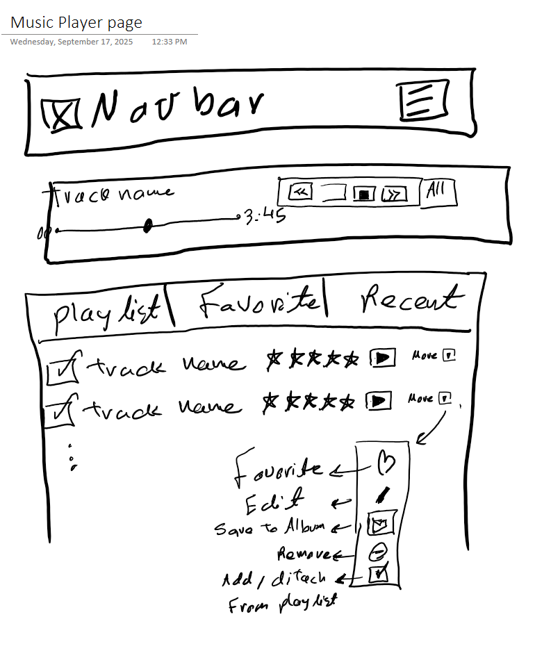
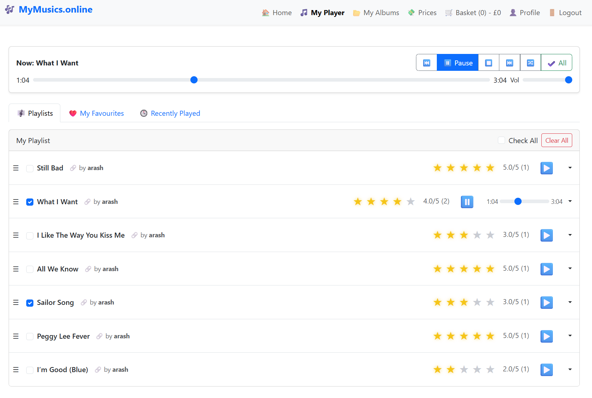

# Music-Archiver

[](#) [](#) [](#license)

**Save, organise, and play web music links with albums, playlists, ratings, favourites, and social saving.**

- **Live Demo:** [https://music-archiver-XXXXX.herokuapp.com](https://music-archiver-XXXXX.herokuapp.com)
- **Repository:** [https://github.com/ie3ul2df/Music-Archiver](https://github.com/ie3ul2df/Music-Archiver)

---

## Table of Contents

- [Project Overview](#project-overview)
- [Wireframes](#screenshots)
- [Architecture & Data Model](#architecture--data-model)
- [Tech Stack](#tech-stack)
- [Getting Started](#getting-started)
  - [Quickstart](#quickstart)
  - [Configuration](#configuration)
- [Deployment on Heroku](#deployment-on-heroku)
- [Testing](#testing)
- [Accessibility & Security](#accessibility--security)
- [Roadmap & Known Issues](#roadmap--known-issues)
- [Troubleshooting / FAQ](#troubleshooting--faq)
- [Contributing](#contributing)
- [License](#license)
- [Credits & Acknowledgements](#credits--acknowledgements)
- [Contact](#contact)

---

## Project Overview

Music-Archiver is a Django web application for storing and streaming user-curated music links. It balances personal libraries with social discovery through collaborative saving, favourites, and ratings.

### Core Features

- User accounts with registration, login, and profile management.
- Album & track CRUD including uploads to Cloudinary or external URLs.
- Drag-and-drop track ordering for albums and playlists.
- Responsive media player with play/pause, next/previous, shuffle, progress, and volume controls.
- Favourites (♥), ratings (★), and recent play history for engagement insights.
- Save other users’ albums/tracks as snapshots with “update available” indicators.
- Search, filtering, and responsive Bootstrap-powered UI.
- Plan management: Free plan (e.g., 3 albums) vs Premium subscriptions via Stripe.
- Cloudinary storage quotas enforced per plan.

---

## Low and High Fidelity Wireframes






---

## Architecture & Data Model

The application follows a standard Django project layout with Django apps for albums, playlists, profiles, and shared utilities. Static files are served via Whitenoise in production, while media uploads are stored in Cloudinary.

- **ERD:** [](static/erd/full-erd.svg)
- **System Diagram (optional):** 

### Key Models

- `User`, `Profile`
- `Album`, `Track`, `AlbumTrack (position)`
- `Playlist`, `PlaylistItem (position)`
- `Favorite`, `SavedAlbum`, `SavedTrack`
- `Rating`, `PlayLog`
- `Plan`, `Subscription` (Stripe)

---

## Tech Stack

- Python {3.12+}
- Django {5.x}
- PostgreSQL (production) / SQLite (development)
- Gunicorn & Whitenoise for WSGI + static serving
- Bootstrap {5} with vanilla JavaScript modules
- Cloudinary for media storage and delivery
- Stripe for subscription billing

---

## Getting Started

### Quickstart

1. Clone the repository and enter the project directory:
   ```bash
   git clone https://github.com/ie3ul2df/Music-Archiver.git
   cd Music-Archiver
   ```
2. Create & activate a virtual environment:
   ```bash
   python -m venv .venv
   source .venv/bin/activate  # On Windows use: .venv\Scripts\activate
   ```
3. Install dependencies:
   ```bash
   pip install --upgrade pip
   pip install -r requirements.txt
   ```
4. Apply migrations and load any fixtures:
   ```bash
   python manage.py migrate
   ```
5. Create a superuser (optional but recommended):
   ```bash
   python manage.py createsuperuser
   ```
6. Run the development server:
   ```bash
   python manage.py runserver
   ```

#### Ready Checklist

- [ ] `.venv` activated
- [ ] `.env` created with required keys
- [ ] Database migrated without errors
- [ ] Admin user created (for dashboard access)

### Configuration

Create a `.env` file in the project root using the template below:

```env
SECRET_KEY=changeme
DEBUG=True
ALLOWED_HOSTS=localhost,127.0.0.1
DATABASE_URL=sqlite:///db.sqlite3
CLOUDINARY_URL=cloudinary://...
STRIPE_PUBLIC_KEY=pk_live_or_test
STRIPE_SECRET_KEY=sk_live_or_test
STRIPE_WEBHOOK_SECRET=whsec_...
```

> ℹ️ **Tip:** When running locally with SQLite, you can omit `DATABASE_URL` and rely on default Django settings.

Static files are collected to `BASE_DIR / "staticfiles"` and served via Whitenoise in production.

---

## Deployment on Heroku

1. Provision a Heroku app and add a PostgreSQL add-on.
2. Set **Config Vars** for every key listed in the `.env` example above.
3. Ensure the `Procfile` contains:
   ```Procfile
   web: gunicorn your_project_module.wsgi
   ```
4. First deploy checklist:
   - [ ] Set `DISABLE_COLLECTSTATIC=1` **before** the first deploy to avoid build failures.
   - [ ] Deploy via GitHub or `git push heroku main`.
   - [ ] Run `python manage.py migrate` on the dyno.
   - [ ] Create an admin user with `python manage.py createsuperuser`.
   - [ ] Remove `DISABLE_COLLECTSTATIC` and run `python manage.py collectstatic`.

> ⚠️ **Whitenoise Pitfall:** Always commit `staticfiles` to `.gitignore`. Let Heroku collect static assets during deploy; missing `STATIC_ROOT` configuration will trigger `ImproperlyConfigured` errors.

> ⚠️ **Gunicorn Module:** Replace `your_project_module` with the actual Django project package name (e.g., `music_project`). A typo here causes immediate “Application Error” responses on Heroku.

---

## Testing

Run the Django test suite:

```bash
python manage.py test
```

For full manual and automated test procedures, see [TESTING.md](TESTING.md).

---

## Accessibility & Security

- Keyboard-accessible media player controls with `aria-label` support on icon buttons.
- GDPR compliance: users can delete their account and purge associated data upon request.
- Copyright notice: Music-Archiver only streams user-supplied links/files and does not host or distribute copyrighted content.

---

## Roadmap & Known Issues

- [ ] Implement collaborative playlists with real-time updates.
- [ ] Add offline caching for recently played tracks.
- [ ] Improve notifications for updated saved albums/tracks.
- [ ] Document Cloudinary quota handling edge cases.
- Known issue: Drag-and-drop uses HTML5 API; Safari versions < 15 may have inconsistent behaviour.

---

## Troubleshooting / FAQ

- **Static files not loading on Heroku?** Ensure `collectstatic` runs after unsetting `DISABLE_COLLECTSTATIC` and that Whitenoise middleware is above Django’s `SecurityMiddleware`.
- **Heroku “Application Error” after deploy?** Check the `Procfile` entry, confirm Gunicorn is installed, and verify `ALLOWED_HOSTS` includes the Heroku domain.
- **Cloudinary returning 401/403?** Double-check `CLOUDINARY_URL` and plan quota; regenerate API keys if the account was reset.
- **Stripe webhook failing locally?** Use the Stripe CLI to forward events and ensure `STRIPE_WEBHOOK_SECRET` matches the CLI output.

---

## Contributing

Contributions are welcome! Please:

1. Fork the repository.
2. Create a feature branch (`git checkout -b feature/your-feature`).
3. Add tests for your changes.
4. Run the test suite and update documentation as needed.
5. Submit a pull request with a clear summary and testing evidence.

---

## License

Distributed under the MIT License. See the [LICENSE](LICENSE) file for details.

---

## Credits & Acknowledgements

- Core development team and community contributors.
- Bootstrap icons and open-source libraries powering the UI.
- Cloudinary and Stripe for generous developer tooling.

---

## Contact

For questions or support, open an issue on GitHub or reach out via the repository maintainers.
